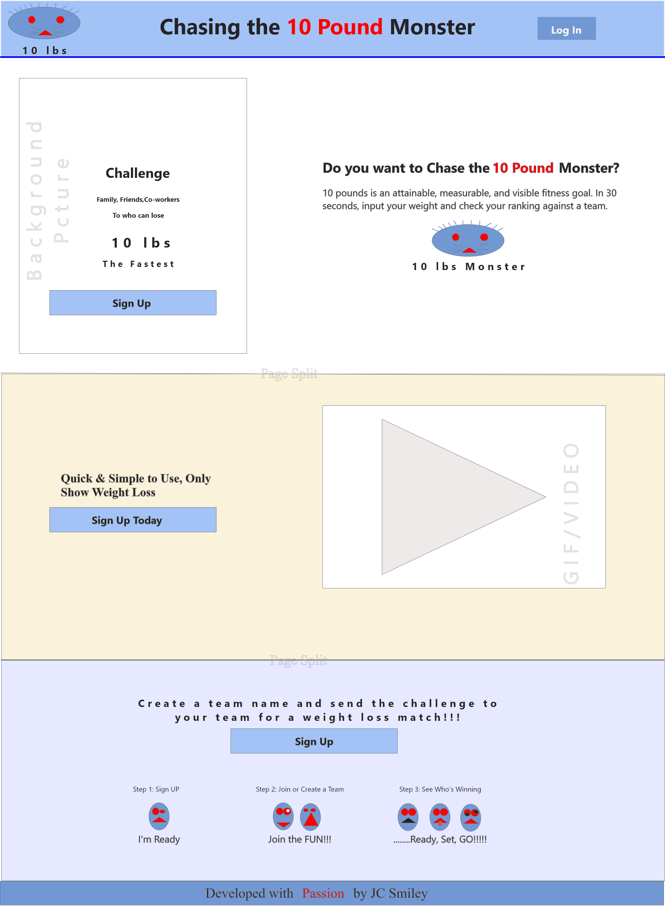

# Chasing the 10 lb Monster

### Table of Contents

1. Demo Link (Coming soon)
2. Purpose
3. Motivation
4. Objectives
5. Wireframe
6. How to Install
7. Technologies Used

### Purpose:

Chasing the 10 Pound Monster is a "Biggest Loser" style weight loss web app. The objective is to be the first player to lose 10 pounds. Players will enter their weight daily into the web app. The web app will show only the gain or loss, not the actual weight, for players.

10 pounds is an attainable, measureable, and visible fitness goal. The best part is it can be done in a short time period. So choose, do you want or need to chase the 10 Pound Monster?

### Motivation:

I work in an office of 25 people. Throughout the year I hosted several biggest loser style challenges using a chalk board to show weekly weigh loss for participants. This arrangement had many pitfalls including failure to get everyone’s weigh-in in a timely manner, weigh-in day on my day off, a participant or myself out of town, and miscalculations in determining weight-loss. I wanted a web-based app that will allow each participant to weigh-in at their own convenient time and place, perfect calculation of weight-loss, and transparency in who won. This would allow me more time to encourage participate to lose weight instead of administration of challenge.

### Objectives:

- Allow the user to create an account.
- Allow an user to create a team and invite players via email to accept/join the challenge.
- Allow an user to join a team of players if they know the team code.
- Allow an user to log into the app, input their weight, and see the current weight loss ranking in their team.

### Landing Page WireFrame:

### How to Install:
**Prerequisites: Node & Create-React-App
1. Clone this Repo: Click the green button that says “Clone or Download”. In the window that appears, select the “Clipboard” icon to copy the repo URL to your clipboard.
2. Open a command terminal and create a directory for the project. 
3. Type git clone "paste the copy git repo link here". Press enter to run.
4. Type "npm install" to install dependencies
5. Type "npm start" to run on localhost http://localhost:3000 

### This app was built with the following technologies:

**React:** JavaScript front-end library for building user interfaces

**React-Router:** Standard routing library for React

**Node.js:** Server side development platform created to run JavaScript

**ExpressJS:** A Node.js web application server framework Create by JC Smiley in May of 2017

**JavaScript:** Object-oriented programming language for web pages

**HTML:** Mark-up language for creating web pages

**CSS:** A formatting language for styling web pages

**Git-Hub:** Web-based version control repository and Internet hosting service

**Abode XD** A wire-framing tool used to create a mockup/visual of what is to be coded

_Create by JC Smiley in March of 2020_
